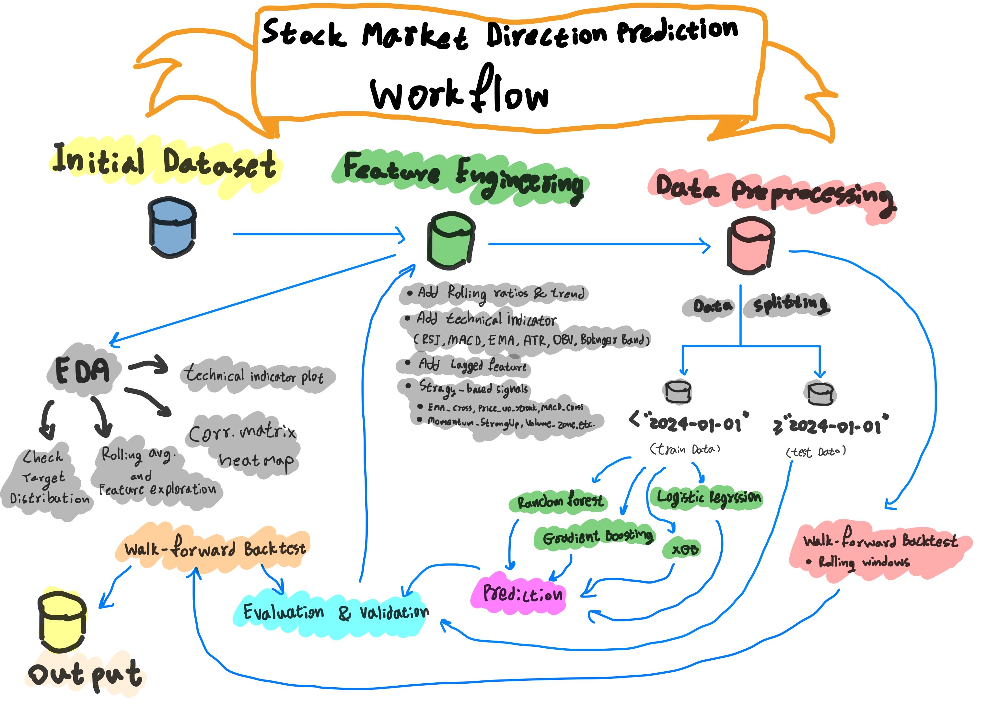

# Create a README.md file with project documentation content
readme_content = """
# 📈 Stock Market Direction Prediction

This project builds a full machine learning pipeline to predict the **direction of the S&P 500 index** using historical price and volume data. The project demonstrates end-to-end practices in data preparation, feature engineering, model selection, backtesting, evaluation, and modular ML pipeline construction.

---
## 🧱 Project Workflow Architecture



---
## 🧠 Project Scope

### 🎯 Goals
- Predict whether the stock price will go **up or down tomorrow** based on technical and historical signals.
- Create an end-to-end machine learning workflow suitable for deployment and research.

### 📊 Data
- Source: Historical OHLCV (Open, High, Low, Close, Volume) data of the **S&P 500 index**.
- Files:
  - `data/raw/sp500_raw.csv`
  - `data/processed/sp500_cleaned.csv` — full cleaned dataset with target
  - `data/processed/sp500_cleaned_model_ready.csv` — modeling-ready feature set

### 🔍 Analysis
- Exploratory Data Analysis (EDA)
- Correlation analysis
- Technical indicator inspection
- Feature-target relationships

---

## 🧩 Machine Learning Pipeline

### 🔨 ETL & Feature Engineering
- Implemented in `02_feature_engineering.ipynb` and `src/feature_engineering.py`
- Added over **30 features** including:
  - Moving averages, RSI, MACD, Bollinger Bands, Momentum, OBV
  - Custom strategy features: trend, crossovers, volatility, streaks

### 📦 Model Building
- Evaluated multiple classifiers: `RandomForest`, `GradientBoosting`, `LogisticRegression`, `XGBoost`
- Performed hyperparameter tuning with `GridSearchCV`
- Metrics used: **precision**, recall, F1-score

### 🔁 Backtesting & Evaluation
- Walk-forward retraining with rolling window
- Saved predictions and visualizations
- Tested robustness and generalization over time

### 🧪 Test on Unseen Data
- Measured real-world generalization with 2024–2025 unseen data
- Analyzed threshold sensitivity and prediction confidence

### ⚙️ ML Workflow & Pipeline
- Modular code in `src/` for reproducibility:
  - `train_model.py`, `evaluate.py`, `feature_engineering.py`, `model.py`, etc.
- Run all components with a single command via `run_all.py`

---

## 📁 Project Structure

```
stock-market-direction-prediction/ 
├── data/ 
│ ├── raw/
│ └── processed/
├── notebooks/ 
│ ├── 01_eda.ipynb 
│ ├── 02_feature_engineering.ipynb 
│ ├── 03_model_training.ipynb 
│ ├── 04_backtesting_and_evaluation.ipynb 
│ └── 05_test_on_unseen_data.ipynb 
├── reports/ 
│ ├── images/ 
│ └── *.md 
├── src/ 
│ ├── feature_engineering.py 
│ ├── model.py 
│ ├── train_model.py 
│ ├── evaluate.py 
│ ├── backtest.py 
│ ├── utils.py 
│ └── data_loader.py 
├── run_all.py 
├── generate_eda_summary.py
├── generate_feature_insights.py
├── generate_model_performance.py
├── requirments.txt
└── README.md
```

---

## 📌 Key Learnings & Takeaways

- **Feature engineering** significantly boosts predictive signal in financial time series.
- A strong **cross-validation strategy** (walk-forward) is essential in finance.
- Class imbalance needs careful handling; precision matters more than accuracy.
- Threshold tuning and confidence analysis reveal trade-offs in real deployment.

---

## 🚀 Next Steps

- Add LSTM/GRU models for temporal sequence modeling
- Extend to multi-asset prediction (NASDAQ, DJIA, individual stocks)
- Use real-time data ingestion and scheduling for live predictions
- Deploy as a web dashboard for visual monitoring

---

## ✅ Results & Findings

- **RandomForest** performed best with **~95% precision** in the test set.
- Some of the most correlated features:
  - `Price_Up_Streak`
  - `Trend_250`
  - `Close_Ratio_250`
- Walk-forward backtest showed stable precision across most years.
- Threshold sensitivity analysis helps to fine-tune tradeoffs.

---

## 🧭 Next Steps

- Add support for live data using APIs (e.g. `yfinance`, `alpaca`).
- Deploy model with scheduled retraining (Airflow, Streamlit).
- Extend to multi-class classification (e.g., Strong Up, Sideways, Down).
- Add economic indicators (inflation, interest rate).

---

## ⚙️ How to Run

```bash
# Install requirements
pip install -r requirements.txt

# Run full pipeline
python run_all.py
```

The results, including models, reports, and visualizations, will be saved in their respective folders.

---

## Project Author

| Name           | Contact Information                                                  |
|----------------|----------------------------------------------------------------------|
| **Surakiat P.** |                                                                      |
| 📧 Email       | [surakiat.0723@gmail.com](mailto:surakiat.0723@gmail.com)   |
| 🔗 LinkedIn    | [linkedin.com/in/surakiat](https://www.linkedin.com/in/surakiat-kansa-ard-171942351/)     |
| 🌐 GitHub      | [github.com/SurakiatP](https://github.com/SurakiatP)                 |
